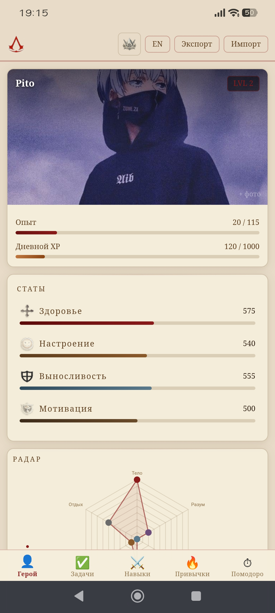

# Nstp3-RPG — Ежедневник с элементами геймификации

<div align="center">
  
  
  <br>
  <sub>Десктоп &nbsp;&nbsp;&nbsp;&nbsp;&nbsp;&nbsp;&nbsp;&nbsp;&nbsp;&nbsp;&nbsp;&nbsp;&nbsp;&nbsp;&nbsp;&nbsp;&nbsp;&nbsp;&nbsp;&nbsp;&nbsp;&nbsp;&nbsp;&nbsp;&nbsp;&nbsp;&nbsp;&nbsp;&nbsp;&nbsp;&nbsp;&nbsp;&nbsp;&nbsp;&nbsp;&nbsp;&nbsp;&nbsp;&nbsp;&nbsp;&nbsp;&nbsp;&nbsp;&nbsp;&nbsp;&nbsp;&nbsp;&nbsp;&nbsp;&nbsp;&nbsp;&nbsp;&nbsp;&nbsp;&nbsp;&nbsp;&nbsp;&nbsp;&nbsp;&nbsp;&nbsp;&nbsp;&nbsp;&nbsp;&nbsp;&nbsp;&nbsp;&nbsp; Мобильная версия</sub>
</div>

> 🌐 **Живая версия:** [nstp3.github.io](https://nstp3.github.io/)

Личный дашборд продуктивности в стиле RPG. Превращает повседневные задачи, привычки и навыки в игровую прокачку персонажа. Работает прямо в браузере — без установки, без сервера, без регистрации.

---

## 🖥️ Возможности

- **Герой** — профиль с аватаром, уровнем и опытом (XP / Daily XP)
- **Статы** — Здоровье, Настроение, Выносливость, Мотивация с прогресс-барами
- **Задачи** — добавление по категориям, выполнение даёт XP
- **Навыки** — прокачка по 6 направлениям с визуализацией прогресса
- **Радар** — паутинка, отражающая текущий баланс навыков
- **Привычки** — трекер по дням месяца с drag-выделением диапазона и подписью каждого дня
- **Помодоро** — таймер с настройкой рабочего / перерывного времени
- **Активность** — график активности по дням
- **3 темы** — Стандартная · Assassin's Creed · Solo Leveling
- **Экспорт / Импорт** — бэкап прогресса в JSON
- **Мультиязычность** — RU / EN

---

## 📱 Android APK

Доступна нативная Android-версия. Работает **офлайн** — все файлы встроены в приложение.

### Скачать APK

[**⬇️ Скачать app-release.apk**](android_version/app-release.apk)

### Установка

1. Скачай файл `app-release.apk` по ссылке выше
2. Открой файл на телефоне
3. Если появится предупреждение → **Настройки → Безопасность → Разрешить установку из неизвестных источников**
4. Нажми **Установить**
5. Иконка **Nstp3 RPG** появится на рабочем столе

> ⚠️ APK собран вручную и не проходил проверку Google Play — это нормально для личного использования.

---

## 📱 Как открыть на телефоне (без APK)

Сайт уже в интернете — просто открой ссылку и добавь на рабочий стол.

### Android — Brave / Chrome

1. Открой [nstp3.github.io](https://nstp3.github.io/) в **Brave** или **Chrome**
2. Нажми **⋮** (три точки) в правом верхнем углу
3. Выбери **«Добавить на главный экран»** или **«Установить приложение»**
4. Подтверди — иконка появится на рабочем столе

### iPhone — Safari

1. Открой [nstp3.github.io](https://nstp3.github.io/) в **Safari**
2. Нажми кнопку **«Поделиться»** (квадрат со стрелкой вверх)
3. Выбери **«На экран "Домой"»**
4. Подтверди — иконка появится на рабочем столе

---

## 💾 Бэкап данных

Все данные хранятся в **IndexedDB** браузера на твоём устройстве (лимит ~500 MB, данные не теряются при обновлении страницы).

- **Экспорт** — кнопка «Экспорт» в топ-баре → сохранит файл `life-rpg-backup.json`
- **Импорт** — кнопка «Импорт» → выбери сохранённый файл

> ⚠️ При полной очистке данных браузера / переустановке приложения данные сотрутся. Делай экспорт регулярно.

Если пользуешься с нескольких устройств — экспортируй на одном, импортируй на другом.

---

## 🎨 Темы оформления

Переключение — кнопка с иконкой в правом верхнем углу топ-бара, выпадающий список.

| | Тема | Стиль |
|---|------|-------|
|  | Стандартная | Тёмно-синяя, цвета `#2e4369` · `#455bb2` · `#cdd3fd` |
|  | Assassin's Creed | Пергамент, тёплые коричневые тона |
|  | Solo Leveling | Тёмно-фиолетовая, неоновые акценты |

---

## 🚀 Локальный запуск (для разработки)

### Требования
- [Node.js](https://nodejs.org/) версии 18+

### Команды

```bash
# Перейди в папку проекта
cd nstp3-rpg

# Установи зависимости
npm install

# Запусти локально
npm run dev
```

Откроется по адресу `http://localhost:5173`

### Сборка и деплой на GitHub Pages

```bash
npm run build
# Готовые файлы появятся в папке dist/
```

### Тест локально с телефона (одна Wi-Fi сеть)

```bash
npm run dev -- --host
```

В терминале появится Network-адрес вида `http://192.168.1.XX:5173` — вбей его в браузер телефона.

---

## 🤖 Сборка Android APK

### Быстрая пересборка (одна команда)

```bash
cd "Пусть к папке проекта  на вашем пк"\
BUILD_TARGET=android npm run build && \
rm -r ~/AndroidStudioProjects/Nstp3RPG/app/src/main/assets/* && \
cp -r dist-android/* ~/AndroidStudioProjects/Nstp3RPG/app/src/main/assets && \
echo "✓ Готово — собирай APK в Android Studio"
```

### Затем в Android Studio

**Build → Generate Signed App Bundle / APK → APK → Next**
Выбери `nstp3key.jks` → пароль → Build Variant: **release** → **Finish**

Готовый файл: `~/AndroidStudioProjects/Nstp3RPG/app/release/app-release.apk`

---

## 📁 Структура проекта

```
nstp3-rpg/
├── android_version/
│   └── app-release.apk       # Android APK (офлайн)
├── readme_assets/            # Иконки тем для README
│   ├── theme-dark.png
│   ├── theme-ac.png
│   └── theme-mythic.png
├── preview.png               # Превью для README
├── index.html
├── package.json
├── vite.config.js
├── assets/                   # Фоновые изображения и иконки
└── src/
    ├── main.js               # Инициализация, темы, события
    ├── renderer.js           # Рендер (десктоп + мобиль)
    ├── state.js              # Стейт приложения
    ├── db.js                 # IndexedDB обёртка
    ├── themes.js             # Конфигурация тем
    ├── icons.js              # Иконки в base64
    ├── xp.js                 # Логика опыта и уровней
    ├── components/           # Компоненты (Stats, Tasks, Habits…)
    ├── styles/               # CSS (base, components, layout)
    ├── ui/                   # Утилиты (toast, progressBar…)
    └── i18n/                 # Переводы RU / EN
```

---

## 🛠️ Стек

| | |
|---|---|
| Сборщик | Vite 5 |
| Язык | Vanilla JS (ES Modules), без фреймворков |
| Стили | CSS Custom Properties, 3 темы |
| Данные | IndexedDB (миграция с localStorage) |
| Графики | Chart.js |
| Хостинг | GitHub Pages |
| Android | WebView APK (Android Studio / Kotlin), офлайн |

---

*Прокачивай себя как персонажа* ⚔️

